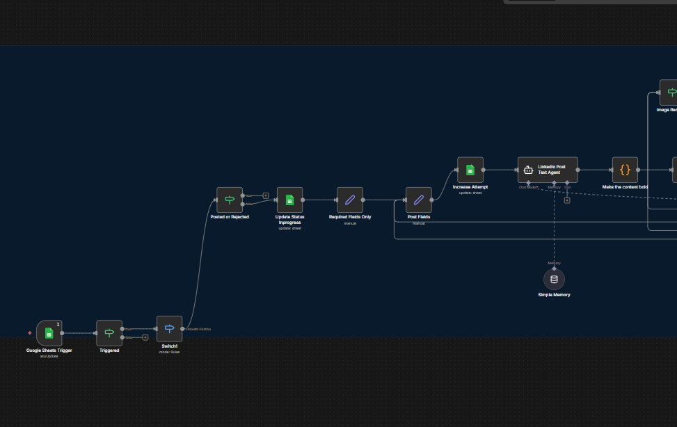
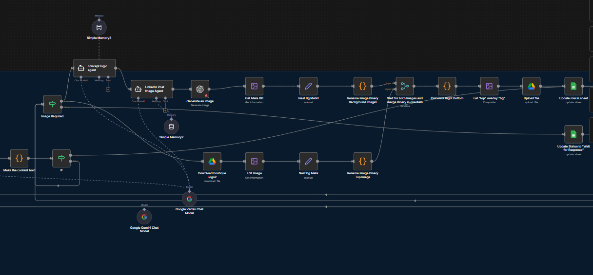
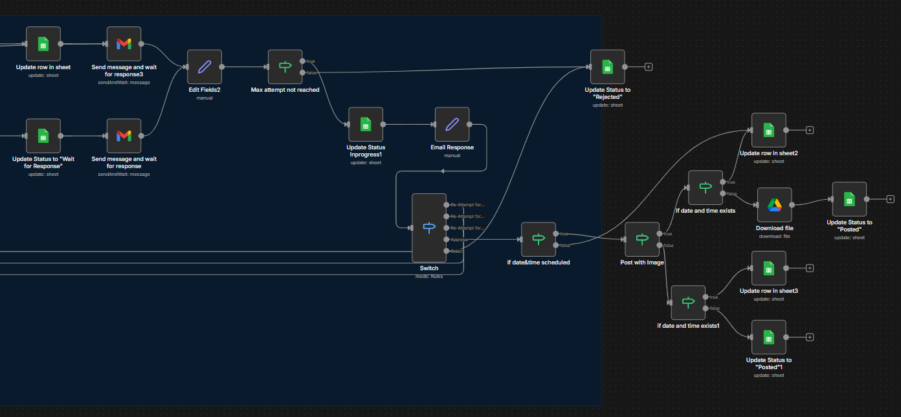
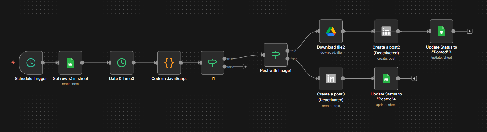

# 🤖 AI-Powered LinkedIn Content Automation

> An end-to-end automation system that takes raw content ideas from a Google Sheet and turns them into **AI-written, AI-illustrated, human-approved LinkedIn posts** — fully automatically.

Built with **n8n** · **Google Vertex AI** · **Gemini** · **DALL-E** · **Gmail** · **LinkedIn API**

---

## 🧩 The Problem

Creating consistent LinkedIn content manually is **slow, repetitive, and inconsistent.**

| ❌ Before | ✅ After |
|---|---|
| Manually write post text | AI writes it from a content brief |
| Manually find or create images | AI generates a custom branded image |
| Manually copy-paste to LinkedIn | Auto-posted via LinkedIn API |
| No review process | Gmail-based approve/reject loop |
| Hours per week | Minutes per week |

---

## 🗺️ System Overview — Two Entry Points

The system has **two independent trigger paths** that converge into the same AI pipeline.

```
╔═══════════════════════════╗        ╔════════════════════════════╗
║   TRIGGER 1 — On Demand   ║        ║   TRIGGER 2 — Scheduled    ║
║   Google Sheets Update    ║        ║   Runs on a set timer      ║
╚═══════════════╦═══════════╝        ╚══════════════╦═════════════╝
                ║                                   ║
                ▼                                   ▼
       Already posted/rejected?          Read all pending rows
       → Skip it                         from Google Sheet
                ║                                   ║
                ▼                                   ▼
       Mark status: In Progress          Check date & time
                ║                        (Australia/Sydney TZ) ⭐
                ║                                   ║
                ╚══════════════╦════════════════════╝
                               ▼
                    ┌─────────────────────┐
                    │  AI CONTENT ENGINE  │
                    └─────────────────────┘
```

---

## 📸 Full Workflow — Part 1
### Trigger → Status Check → AI Text Generation



**What's happening here:**
- `Google Sheets Trigger` fires when a row is updated
- `Switch1` checks: is this post already **Posted** or **Rejected**? If yes → skip
- Status is updated to **"In Progress"** in the sheet
- Required fields are extracted and passed to the **LinkedIn Post Text Agent**
- The AI agent (powered by Google Vertex AI) writes the full LinkedIn post
- A custom JS node converts `**bold text**` → Unicode bold characters `𝗹𝗶𝗸𝗲 𝘁𝗵𝗶𝘀` ⭐

> ⭐ **Unicode Bold:** LinkedIn has no native bold support. This system converts markdown bold syntax into Unicode bold characters so posts visually stand out in the feed — something most automation tools miss entirely.

---

## 📸 Full Workflow — Part 2
### AI Image Generation → Compositing Pipeline



**What's happening here:**
- After text is generated, the system checks: **does this post need an image?**
- If yes → **Concept Logic Agent** analyzes the post and extracts a visual concept as structured JSON
- **LinkedIn Post Image Agent** takes that concept and writes an optimized DALL-E prompt
- **DALL-E** generates the AI image
- The **Image Compositing Pipeline** then: ⭐
  - Downloads the brand logo from Google Drive
  - Gets metadata (dimensions) of both images
  - Renames binaries to avoid conflicts
  - Merges both into a single item
  - Calculates the exact pixel position for logo placement (bottom-right)
  - Composites logo on top of AI image
  - Uploads final branded image to Google Drive

> ⭐ **Auto Brand Compositing:** Every AI-generated image automatically gets the client's logo overlaid at a calculated position — maintaining brand consistency without any manual work.

---

## 📸 Full Workflow — Part 3
### Human Approval Loop → Smart Retry → LinkedIn Post



**What's happening here:**

```
Post is ready (text + optional image)
              │
              ▼
   Status → "Waiting for Response"
              │
              ▼
   Gmail sent to human reviewer
   (contains post + image + Approve/Reject buttons)
   ⏸️  Workflow PAUSES and waits for reply
              │
       ┌──────┴──────┐
       ▼             ▼
   APPROVED       REJECTED
       │             │
       ▼             ▼
  Check           Increment
  schedule        attempt count
       │             │
       ▼        ┌────┴────┐
  Post to       ▼         ▼
  LinkedIn   Max limit  Under limit
       │     reached    → Regenerate
       ▼         │        & resend
  Status →   Status →
  "Posted" ✅ "Rejected" ❌
```

> ⭐ **Smart Retry System:** Rejection doesn't kill the workflow. The system increments an attempt counter — if under the limit, it regenerates content and sends a fresh email. If max attempts are hit, it gracefully marks as Rejected and moves on. No infinite loops.

> ⭐ **Timezone-Aware Scheduling:** Before posting, the JS node converts the scheduled time to Australia/Sydney timezone — so posts go out at exactly the right local time regardless of server location.

---

## 📸 Schedule Trigger Flow
### Automated Timer-Based Posting



**What's happening here:**
- A `Schedule Trigger` fires at regular intervals
- Fetches all rows from Google Sheet
- `Date & Time` node + custom JavaScript checks if `Scheduled Date + Time` has arrived
- If yes → passes to the posting pipeline
- Checks if post has an image → downloads from Drive if needed
- Creates LinkedIn post (with or without image)
- Updates status to **"Posted"** in Google Sheet ✅

---

## ⭐ Key Features at a Glance

| Feature | What it does |
|---|---|
| 🔀 **Dual Triggers** | On-demand (sheet update) + scheduled timer — both work independently |
| 🤖 **3 AI Agents** | Separate agents for post writing, concept analysis, and image prompting |
| 𝗕 **Unicode Bold Text** | Converts `**bold**` markdown into LinkedIn-compatible unicode bold |
| 🖼️ **Auto Image Compositing** | Brand logo is programmatically overlaid on every AI-generated image |
| ✅ **Human Approval Loop** | Every post requires explicit email approval before going live |
| 🔁 **Smart Retry on Reject** | Auto-regenerates content on rejection, stops at a max attempt limit |
| 🕐 **Timezone Scheduling** | Converts post times to Australia/Sydney TZ for accurate scheduling |
| 📊 **Full Status Tracking** | Google Sheet tracks every post: Pending → In Progress → Posted / Rejected |
| 🧠 **Agent Memory** | AI agents use memory buffers for contextual consistency across the session |

---

## 🛠️ Tech Stack

| Tool | Role |
|---|---|
| **n8n** | Automation engine & workflow orchestrator |
| **Google Vertex AI** | Primary LLM powering all 3 AI agents |
| **Google Gemini** | Secondary/fallback LLM |
| **OpenAI DALL-E** | AI image generation |
| **Google Sheets** | Content calendar & live status tracking |
| **Google Drive** | Image storage (generated + brand assets) |
| **Gmail** | Human-in-the-loop approval emails |
| **LinkedIn API** | Final post publishing |

---

## 📁 How to Use

Import the workflow into any n8n instance:

```
Workflows → Import from file → select linkedin.json
```

---

*Built solo. Deployed for a real production client. Currently live.*
